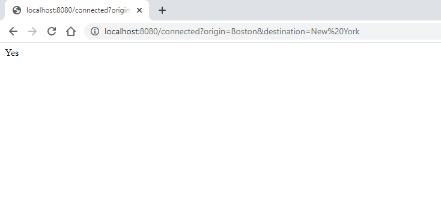
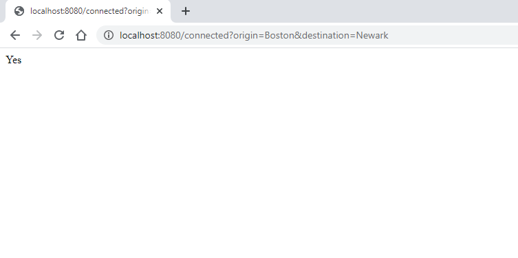
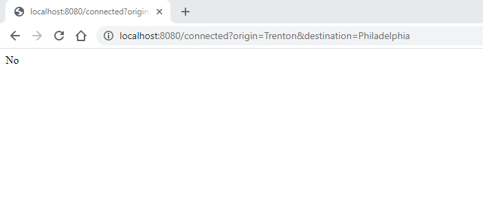

# ***MasterCard Assessment***

## **Task** :
-------------
**Write a web service in spring boot (java 1.8 +), to check connectivity between 2 cities (direct or indirect), based on the content of a file (city.txt), which is provided.**
**The file contains a list of city pairs (one pair per line, comma separated), which indicates that there’s a road between those cities.**

## **Contents**:
-----------------
* **[Approach](#My-Approach)**
* **[Logic](#Logic)**
* **[Requirements](#Requirements)**
* **[Commands to run the project](#Commands-to-run-the-project)**
* **[Command to run the tests](#Command-to-run-the-tests)**
* **[Expected Response](#Expected-Response)**
* **[Snippets](#Snippets)**


## **My Approach** :
---
**I am using "resourceloader/DataService" to provide data from text file (city.txt), which is present in "classpath : static/city.txt". A data service is written in it, which is**
**using ResouceLoader class of java to parse the data from the file. And then we create a graph using that data for implementing connectivity of cities.**
**Next I have built RestController ("Controller/ApiController"), it is fetching the data from the GET query string and passing it to DataService for processing it.**
**And then the DataService is returning the corresponding result, that is "Yes" (if there exists a route), or "No" (if there does not exist any such route).**


## **Logic** :
---
**What I am doing is I am creating a graph from the connectivity data I got from "city.txt"**

**Then what I am doing is that, I am finding a BFS route starting from "origin" city node to "destination" city node.**
**If found any, I am returning "Yes", else returning "No", in case found none or encountered invalid input.**

## **Requirements :**
---
* **JDK (1.8 +)**
* **IDE (Intellij preffered)**
* **Build tool (Maven)**
* **Web browser (Or Postman application)**


## **Commands to run the project** :
---
```bash
git clone < url_of_repository >
```
* Open the cloned folder in intellij.
* Configure Intellij as follows: Edit configuration --> Add new maven configuration --> Write "spring-boot:run" in command line agrument.

Or you can just run :
```bash
mvn clean install
mvn spring-boot:run
```

Then hit the endpoint "http://localhost:8080/connected?origin=city1&destination=city2".

## **Command to run the tests :**
---
```bash
mvn test
```


## **Expected Response :**
---
* ***http://localhost:8080/connected?origin=Boston&destination=Newark*  :   yes**

* ***http://localhost:8080/connected?origin=Boston&destination=Philadelphia*    :   yes**

* ***http://localhost:8080/connected?origin=Philadelphia&destination=Albany*    :   no**


## **Snippets :**
---


